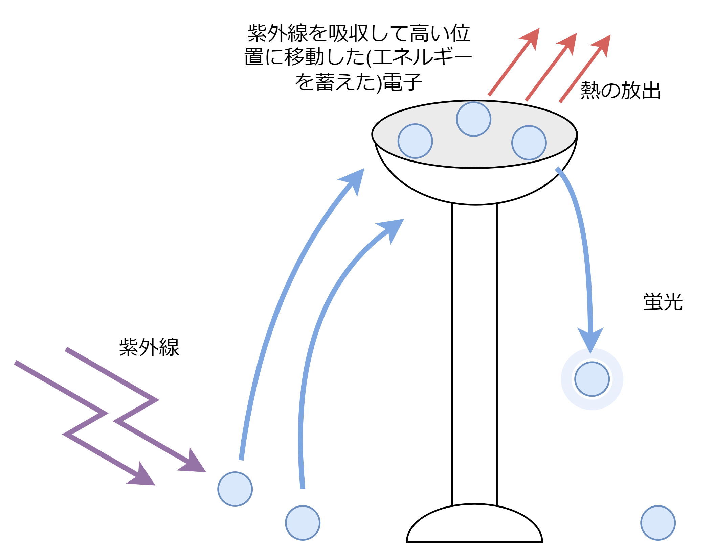
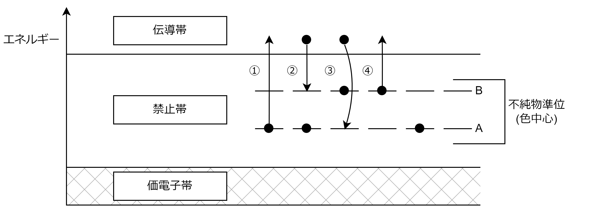

※上記の画像をクリックするとシミュレーションが起動します(起動に数分程度かかることがあります)。

## 蛍光の定義

本ページで解説する蛍光とは、鉱物に紫外線を当てた場合、その鉱物が光る現象を指します。

## 蛍光を示す鉱物

蛍光を示す鉱物は数多くあり、本教材で扱っている鉱物はほぼすべてが蛍光を示します(ただし、同じ鉱物であっても、ものによって蛍光しないものもありますので、蛍光の観察目的で購入する際などは注意が必要です)。身近な鉱物であれば、ダイヤモンドやオパールなども蛍光を示します。

## 蛍光の原理

### 簡易的な説明

これはエネルギーの高低を場所の高低に準えた電子の動きのイメージ図です。

紫外線は波長が短い分、高いエネルギーを持ちます。そのため、紫外線が当たるとその物質の電子のエネルギーも高くなり、エネルギーを蓄えます(高い位置に移動するイメージ)。ただし、この位置は不安定なため、電子は元の安定した位置まで落ちようとします。このとき、電子が持っていたエネルギーが、熱のほかに、光エネルギーとして放出されます。これが蛍光として見えるのです。

### 詳しい説明

蛍光の原理は、バンド理論によって説明できる。
図中の用語の意味は次の通りである。

価電子帯：電子が充満しているバンドのこと。同じ結晶中の最外殻の電子がとるエネルギーは、すべて異なる(パウリの排他理論)。この最外殻電子がとるエネルギーの幅とも考えられる。
禁止帯：価電子帯と伝導帯にあいだにあるギャップのこと。
伝導帯：価電子帯・禁止帯よりエネルギーが高い位置にある、電子があまり存在しないバンドのこと。

鉱物に入り込んだ不純物は、結晶中の禁止帯に電子を持つ。この位置を不純物準位という。また、着色を誘起するため、色中心でもある。この不純物準位にある電子が遷移することによって蛍光が起こる。

まず、図中の①のように、Aの準位に入っていた電子が、紫外線によって伝導帯まで励起される。しかしこの位置では不安定なため、②のように、安定している禁止帯まで戻ろうとする。この時に熱及び光エネルギーが発せられ、それが私たちの目には蛍光しているように見える。③のように、Aの位置まで落ちることもあるが、この際は紫外線に近い光を放出するため、蛍光として視認できない。

### テネブレッセンス

蛍光のほかにも、紫外線によって鉱物の色が変わる現象として、テネブレッセンスがあります。テネブレッセンスを示す鉱物の一つにハックマン石があります。当サイトの[ハックマン石のページ](https://bicpema-blog.web.app/model/%E3%83%8F%E3%83%83%E3%82%AF%E3%83%9E%E3%83%B3%E7%9F%B3/)にて、テネブレッセンスした鉱物の3Dモデルやテネブレッセンスに関する解説を見ることができます。

## スペクトルとは

どの波長(色)がどの程度の割合で含まれているのかを表したものです。本教材では、どの波長がどの色に対応するのかの目安は、各スペクトルの下部に表示しています。どの波長(色)が一番強いのか、波長(色)の強度(強ければ強いほど明るい)や、ピークの幅(鋭さ)などの情報から、色の特徴をつかむことができます。

## 教材内用語の解説

### 母体結晶

鉱物から不純物を取り除き、純粋な物質としたときの組成のことです。

### アクチベーター

鉱物に入り込んだ不純物で、発光要因となる元素のことです。

### 結晶系

鉱物は同じ原子配列が繰り返し規則正しく並んでいます。基本の大きさである「単位格子」の形態にグループ分けしたものが晶系です。

結晶軸の角度と軸の長さに応じて、次の7つに分類されます。

- 立方晶系(等軸晶系)：3本の結晶軸の長さが等しく、すべて90度で交差している。
- 正方晶系：3本の結晶軸のうち2本の長さが等しく、すべて90度で交差している。
- 直方晶系：3本の結晶軸の長さがそれぞれ異なり、すべて90度で交差している。
- 単斜晶系：3本の結晶軸の長さがそれぞれ異なり、このうち2本が90度で交差している。
- 三斜晶系：3本の結晶軸の長さがそれぞれ異なり、3本とも90度以外の異なる角度で交差している。
- 三方晶系：3本の結晶軸の長さが等しく、すべて90度以外の同じ角度で交差する。
- 六方晶系：4本の結晶軸のうち3本が同じ長さで、60度で交わる。残りの1本は異なる長さで垂直に交わる。

また、結晶構造を持たず、規則性のないものを非結晶質(アモルファス/非晶質)という。オパールなどがこれにあたります。

### モース硬度

ひっかいたときの傷のつきにくさを基準とした、硬さの尺度のことです。下記がモース硬度と標準鉱物です。

- モース硬度1：滑石 (最も軟らかい鉱物。爪で簡単に傷をつけられる)
- モース硬度2：石膏 (指の爪で何とか傷をつけることができる)
- モース硬度3：方解石 (硬貨でこするとなんとか傷をつけることができる)
- モース硬度4：蛍石 (ナイフの刃で簡単に傷をつけることができる)
- モース硬度5：燐灰石 (ナイフでなんとか傷をつけることができる)
- モース硬度6：正長石 (ナイフで傷をつけることができず、刃が傷む)
- モース硬度7：石英 (ガラスや鋼鉄などに傷をつけることができる)
- モース硬度8：トパーズ (石英に傷をつけることができる)
- モース硬度9：コランダム (石英にもトパーズにも傷をつけることができる)
- モース硬度10：ダイヤモンド (地球上の鉱物の中で最も硬く、コランダムにも傷をつけることができる)

標準鉱物と試料をこすり合わせ、傷ができるかどうかで硬さが測定されます。

## 参考文献

- [ニュートンプレス (2022)：鉱物大図鑑， ニュートンプレス](https://www.newtonpress.co.jp/book/Daizukan/220620-Mineralzukan.html)
